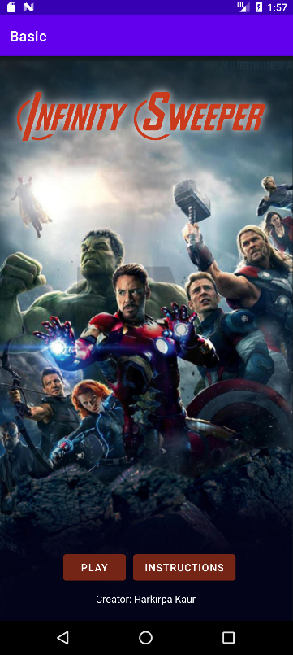
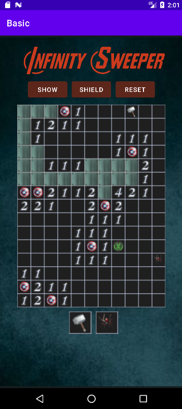
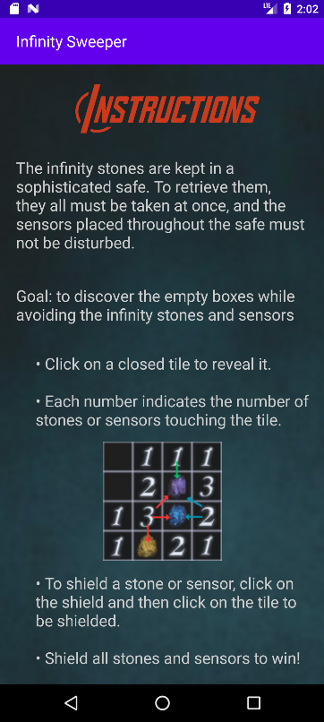
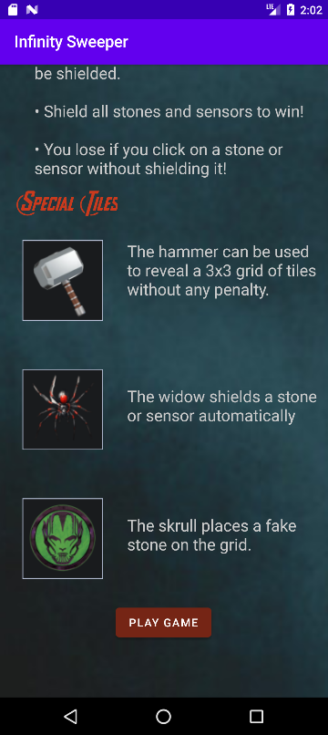

# Infinity Sweeper  
**Android Grid-Based Application (Java, Android Studio)**

Infinity Sweeper is a native Android application built in **Java** that demonstrates grid-based state management, recursive algorithms, and event-driven UI design using the Android SDK. The project is inspired by Minesweeper, with additional mechanics designed to stress extensibility and clean application logic.

---

## 📱 Screenshots

  
  
  

  

---

## 🛠 Tech Stack
- **Language:** Java  
- **Platform:** Android  
- **IDE:** Android Studio  
- **UI:** XML layouts (`GridLayout`, `ImageView`, `ImageButton`)  
- **Build System:** Gradle  

---

## 🔍 Core Technical Concepts

### Grid-Based State Management
- Board state tracked using multiple **2D arrays** to represent:
  - Cell values (mines, counts, special tiles)
  - Revealed state
  - Flagged state
- Clear separation between **game state** and **UI rendering**

### Recursive Flood-Fill Algorithm
- Implemented a **recursive traversal** to reveal contiguous empty regions
- Includes:
  - Boundary checks
  - Early termination conditions
  - Prevention of infinite recursion
- Similar to flood-fill techniques used in graphics and image processing

### Event-Driven UI
- Dynamic grid constructed programmatically at runtime
- Touch events mapped to grid coordinates
- UI updates handled through a centralized redraw method

### Application Flow & Navigation
- Multi-activity navigation using **Intents**
- Dialog-based error handling for loss conditions
- Win/loss logic driven by application state rather than direct UI triggers

### Debugging & Testing
- Debugged and validated behavior using **Android Emulator and Logcat**
- Tested edge cases including:
  - Boundary conditions
  - Recursive reveal behavior
  - Win/loss detection logic

---

## ✨ Additional Mechanics (Extensibility Focus)
The project includes optional mechanics (e.g., power-ups) implemented without hard-coding behavior, demonstrating how core logic can be extended without breaking existing functionality.

---

## 🚀 How to Run
1. Clone the repository
2. Open in **Android Studio**
3. Sync Gradle
4. Run on an emulator or physical device (API 21+)

---

## 📌 Notes
This project was developed to strengthen understanding of:
- Android application structure
- State-driven UI updates
- Algorithmic problem-solving in a mobile context

---

**Author:** Harkirpa Kaur
